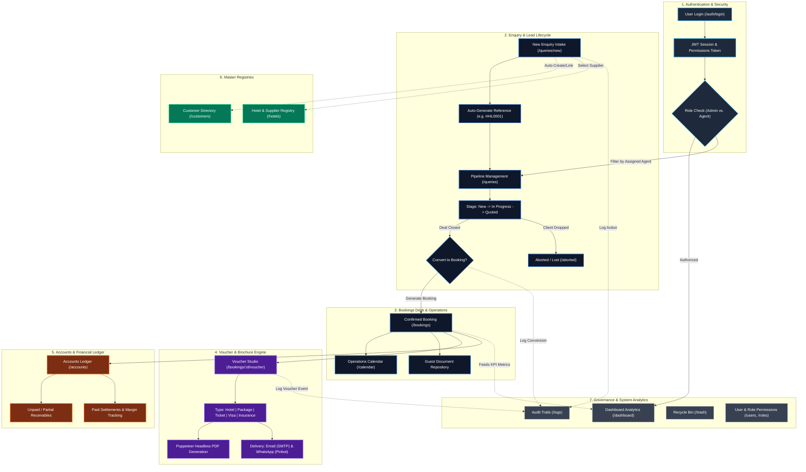

# HelloJi Travel Booking Desk CRM — Complete Workflow & Architecture Guide

This document maps out the entire system architecture, module interconnections, and the complete business data flow for the HelloJi Travel Booking Desk CRM.

---

## 1. System Architecture & Module Interconnection Flowchart

---

## 2. Detailed Module Breakdown & Interconnections

### Module 1: Authentication & Role-Based Access Control (RBAC)
- **Role Isolation:**
  - **Super Admin:** Complete visibility across all team members, financial margins, role configurations, and audit logs.
  - **Agent / Operator:** Scoped strictly to enquiries and bookings assigned to their ID. Protected from viewing unassigned leads or unauthorized financial data.
- **Interconnection:**
  - The JWT token contains the user's role and granular permissions matrix (e.g. `queries:read`, `bookings:create`, `accounts:manage`). Every backend API route validates these claims before returning data.

---

### Module 2: Dashboard & Business Intelligence (`/dashboard`)
- **Key Metrics:** Real-time KPI counters for *New Enquiries*, *Active Bookings*, *Registered Customers*, and *Aborted Leads*.
- **Visual Trends:** Monthly lead volume line charts and revenue performance bar charts.
- **Interconnection:**
  - Pulls aggregated metrics directly from the `Booking` and `Customer` collections.
  - Acts as the central navigation launchpad to all operational sub-modules.

---

### Module 3: Enquiry & Lead Pipeline (`/queries` & `/queries/new`)
- **Intake Flow:**
  - Capture guest name, phone, email, destination, travel dates, passenger counts, and hotel preferences.
  - Generates standardized custom identifier formats (e.g., `HHL0001`).
- **Customer Auto-Linking:**
  - When an enquiry is created, the system checks if the customer's phone number exists in the database. If not, a new profile is automatically created in the **Customer Directory**.
- **Conversion Flow:**
  - With a single click (*Convert to Booking*), the enquiry is migrated to the active Bookings desk, preserving all notes, dates, and hotel details.

---

### Module 4: Bookings Operations Desk (`/bookings` & `/calendar`)
- **Management:** View confirmed travel dates, booking statuses (*Confirmed*, *Voucher Issued*, *In Transit*, *Completed*, *Cancelled*).
- **Operations Calendar (`/calendar`):** Month/week schedule view displaying check-ins, check-outs, and flight dates for active guests.
- **Interconnection:**
  - Direct bridge between the sales front (Queries) and fulfillment (Vouchers & Accounts).

---

### Module 5: Voucher & Brochure Studio (`/bookings/:id/voucher`)
- **Multi-Product Engine:** Supports 6 layout templates:
  1. **Hotel Voucher** (check-in/out, meal plan, room category, confirmation numbers)
  2. **Tour Package Brochure** (day-wise itinerary, inclusions, exclusions)
  3. **Flight / Transport Ticket** (departure/arrival, PNR, baggage)
  4. **Visa Document** (visa category, validity, nationality)
  5. **Travel Insurance** (policy numbers, emergency coverage)
  6. **Product Brochure** (general travel offerings)
- **Branding & Presentation:**
  - Official **HELLO Ji** and **Incredible India** logos and header badges.
  - *With Header* toggle enables downloading on plain paper or on pre-printed agency stationery.
- **Delivery Engine:**
  - **PDF Export:** Powered by server-side headless Chromium (Puppeteer) with high-fidelity client-side html2canvas fallback.
  - **Email & WhatsApp:** Direct client dispatch with structured 503 safeguards if third-party credentials are not configured.

---

### Module 6: Accounts & Financial Ledger (`/accounts`)
- **Split Receivables:**
  - **Unpaid / Partial Ledger:** Tracks outstanding balances, payment due dates, and client follow-ups.
  - **Paid Ledger:** Reconciles fully settled payments and reports realized profit margins.
- **Interconnection:**
  - Tightly coupled to every booking: updates billing state when bookings are modified.

---

### Module 7: Master Registries (`/customers` & `/hotels`)
- **Customer Directory:** Stores traveller history, passport copies, visa documents, and past booking records.
- **Hotel & Supplier Directory:** Stores contracted supplier contacts, star ratings, amenities, and location master data.
- **Interconnection:**
  - Supplies dropdown data to enquiries and bookings, preventing repetitive manual data entry.

---

### Module 8: Audit, Governance & Recovery (`/logs` & `/trash`)
- **Activity Logs:** Immutable compliance trail recording who performed which action (*User*, *Action*, *Target Entity*, *Timestamp*, *IP*).
- **Recycle Bin (`/trash`):** Two-tier deletion with soft-delete recovery protection to prevent accidental data loss.
